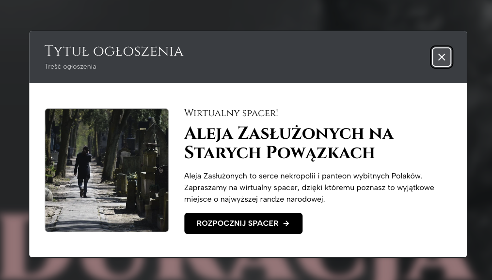
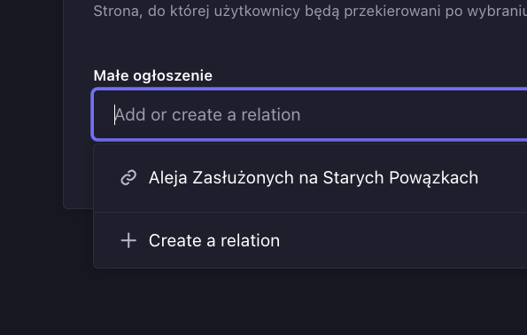

import { Tabs, TabItem } from "@astrojs/starlight/components";

Strona internetowa pozwala na dodawanie trzech typów ogłoszeń: **ogłoszenia popup**, **ogłoszenia w formie slajdów** oraz **ogłoszenia w postaci małego baneru**.

## Dodawanie i edycja bazowego ogłoszenia

Aby dodać lub edytować bazowe ogłoszenie, należy wejść w zakładkę **Announcements**. Następnie należy wybrać ogłoszenie z listy w celu edycji, lub kliknąć w przycisk **Create new entry**, aby utworzyć nowe ogłoszenie.

Na stronie edycji / dodawania ogłoszenia należy uzupełnić wszystkie wymagane pola a następnie zapisać i opublikować ogłoszenie.

<video src="/videos/announcements/1.mp4" controls width="100%"></video>

## Dodawanie ogłoszenia popup

Jeżeli dodane mamy już ogłoszenia, które chcemy wyświetlić w popupie, możemy teraz utworzyć popup. W tym celu należy przejść do zakładki **WebPopUps**, kliknąć w przycisk **Create new entry**, a następnie uzupełnić wszystkie wymagane pola formularza.

Na końcu wybieramy witryny, na których wyświetlany będzie popup oraz ogłoszenia bazowe, które w danym popupie będą pokazywane. Na samym końcu należy zapisać i opublikować popup.

<video src="/videos/announcements/2.mp4" controls width="100%"></video>

Ogłoszenie w formie popupu wyglądać będzie następująco:

:::note
Popup pokazywany będzie użytkownikom jednokrotnie, ze względu na witrynę. Po zakmnięciu popupu przez użytkownika, nie zostanie on już wyświetlony przy ponownym odwiedzeniu witryny. Jeżeli jednak zostanie on zaktualizowany w systemie (np. zmieniony zostanie tytuł ogłoszenia), popup pokazany zostanie wszystkim użytkownikom na nowo.
:::

## Dodawanie ogłoszenia w formie slajdów

Dodanie ogłoszeń w formie slajdów polega jedynie na przypisaniu ogłoszenia do konkretnych witryn, a następnie podjęcie decyzji: czy ogłoszenia w formie slajdów wyświetlane mają być jedynie na stronie głównej, czy też na wszystkich podstronach danej witryny.

<video src="/videos/announcements/3.mp4" controls width="100%"></video>

Ogłoszenie w formie popupu wyglądać będzie następująco:

<Tabs>
  <TabItem label="Strona główna"></TabItem>
  <TabItem label="Pozostałe strony">
    
  </TabItem>
</Tabs>

## Dodawanie ogłoszenia w postaci małego baneru

Dodawanie ogłoszenia w postaci małego baneru polega na przypisaniu utworzonego ogłoszenia bazowego do pola **Małe ogłoszenie** w ustawieniach danej witryny. Wystarczy wejść w zakładkę **Site**, wybrać witrynę, na której wyświetlane będzie dane ogłoszenie, a następnie przypisać to ogłoszenie w odpowiednim polu:

Na końcu należy zapisać i opublikować ustawienia witryny.

Ogłoszenie w postaci małego baneru wyglądać będzie następująco:

